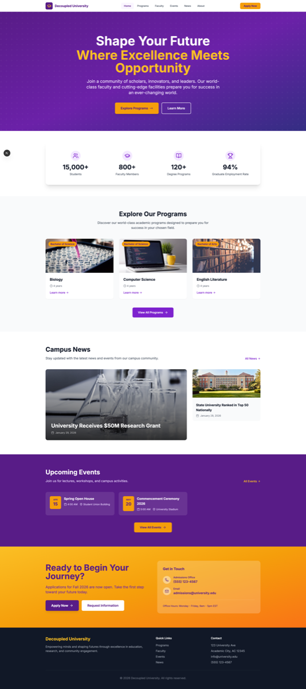

# Decoupled School District

A K-12 school district website starter template for Decoupled Drupal + Next.js. Built for public school districts, independent school districts, and educational administrative organizations.



## Features

- **Schools** - Showcase elementary, middle, and high schools with enrollment counts, principals, addresses, and academic programs
- **Board Members** - Display school board members with positions, terms, contact information, and photos
- **Programs** - Highlight district programs in STEM, arts, athletics, and special education with eligibility and grade levels
- **Events** - Promote board meetings, open houses, graduation ceremonies, and community activities
- **News** - Publish district news, announcements, and press releases with categories and featured flags
- **Modern Design** - Clean, accessible UI optimized for school district and education content

## Quick Start

### 1. Clone the template

```bash
npx degit nextagencyio/decoupled-school-district my-school-district
cd my-school-district
npm install
```

### 2. Run interactive setup

```bash
npm run setup
```

This interactive script will:
- Authenticate with Decoupled.io (opens browser)
- Create a new Drupal space
- Wait for provisioning (~90 seconds)
- Configure your `.env.local` file
- Import sample content

### 3. Start development

```bash
npm run dev
```

Visit [http://localhost:3000](http://localhost:3000)

---

## Manual Setup

If you prefer to run each step manually:

<details>
<summary>Click to expand manual setup steps</summary>

### Authenticate with Decoupled.io

```bash
npx decoupled-cli@latest auth login
```

### Create a Drupal space

```bash
npx decoupled-cli@latest spaces create "My School District"
```

Note the space ID returned. Wait ~90 seconds for provisioning.

### Configure environment

```bash
npx decoupled-cli@latest spaces env 1234 --write .env.local
```

### Import content

```bash
npm run setup-content
```

This imports:
- Homepage with hero, stats (12,500+ students, 18 schools, 900+ teachers, 96% graduation rate), and enrollment CTA
- 4 schools: Oakridge Elementary, Pine Valley Elementary, Oakridge Middle, Oakridge High
- 4 board members: Sarah Thompson (President), Michael Garcia (VP), Jennifer Williams (Secretary), Robert Davis (Member)
- 3 programs: STEM Initiative, Fine Arts Program, Athletics Program
- 3 events: Board Meeting, Spring Open House, Class of 2026 Graduation
- 3 news articles: Bond Measure Approved, STEM Excellence Award, State Basketball Championship
- 2 static pages: About Oakridge School District, Enrollment Information

</details>

## Content Types

### School
- **school_level**: Level taxonomy (Elementary, Middle School, High School)
- **address**: School street address
- **phone**: School phone number
- **principal**: Name of the school principal
- **enrollment_count**: Number of enrolled students
- **image**: School photo

### Board Member
- **position**: Board role (President, Vice President, Secretary, Member)
- **email**: Board member email
- **phone**: Board member phone
- **photo**: Board member headshot
- **term_start / term_end**: Term dates

### Program
- **program_area**: Area taxonomy (STEM, Arts, Athletics, Special Education)
- **eligibility**: Who can participate
- **grades_served**: Grade levels served by the program
- **image**: Program image

### District Event
- **event_date / end_date**: Event date and time range
- **location**: Where the event takes place
- **event_type**: Type taxonomy (Board Meeting, Open House, Athletics, Community)
- **registration_url**: Link to event registration
- **image**: Event promotional image

### News Article
- **image**: Featured article image
- **category**: Category taxonomy (Announcements, Academics, Athletics, Community)
- **featured**: Whether the article is featured

### Homepage
- **hero_title**: Main headline (e.g., "Excellence in Education")
- **hero_subtitle**: Secondary tagline
- **hero_description**: Welcome message
- **stats_items**: Key statistics (students, schools, teachers, graduation rate)
- **featured_schools_title**: Section heading for schools
- **cta_title / cta_description**: Enrollment call-to-action block

### Basic Page
- General-purpose static content pages (About, Enrollment, etc.)

## Customization

### Colors & Branding
Edit `tailwind.config.js` to customize colors, fonts, and spacing.

### Content Structure
Modify `data/school-district-content.json` to add or change content types and sample content.

### Components
React components are in `app/components/`. Update them to match your design needs.

## Demo Mode

Demo mode allows you to showcase the application without connecting to a Drupal backend.

### Enable Demo Mode

```bash
NEXT_PUBLIC_DEMO_MODE=true
```

### Removing Demo Mode

1. Delete `lib/demo-mode.ts`
2. Delete `data/mock/` directory
3. Delete `app/components/DemoModeBanner.tsx`
4. Remove `DemoModeBanner` from `app/layout.tsx`
5. Remove demo mode checks from `app/api/graphql/route.ts`

## Deployment

### Vercel (Recommended)
[](https://vercel.com/new/clone?repository-url=https://github.com/nextagencyio/decoupled-school-district)

### Other Platforms
Works with any Node.js hosting platform that supports Next.js.

## Documentation

- [Decoupled.io Docs](https://www.decoupled.io/docs)
- [Next.js Documentation](https://nextjs.org/docs)
- [Drupal GraphQL](https://www.decoupled.io/docs/graphql)

## License

MIT
